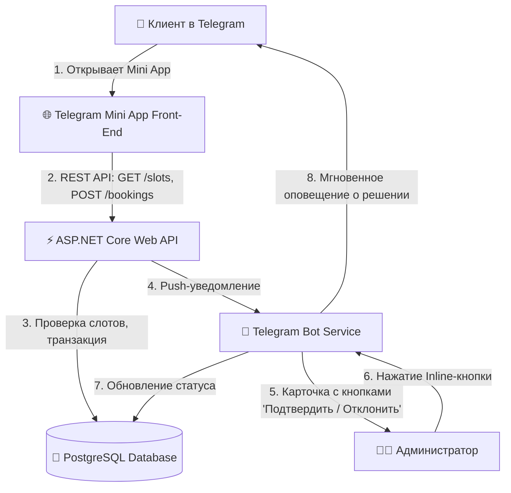
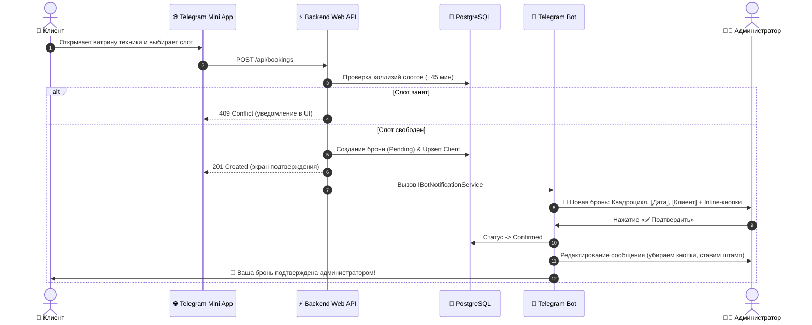

# 🏍 MotoRental — Telegram Mini App & Booking System

[](https://dotnet.microsoft.com/)
[](https://docs.microsoft.com/en-us/dotnet/csharp/)
[](https://www.postgresql.org/)
[](https://telegram.org/)
[](LICENSE)

Полнофункциональный production-ready MVP системы онлайн-бронирования проката мототехники (квадроциклы, эндуро, багги). Проект включает интеграцию **Telegram Mini App (TMA)** с нативной поддержкой тем Telegram, REST API на **ASP.NET Core (.NET 8)**, базу данных **PostgreSQL (EF Core)** и панель администратора внутри Telegram-бота с функцией массовой рассылки сообщений.

---

## 🏗 Архитектура системы



### Диаграмма взаимодействия (Sequence Diagram)



---

## 🛠 Технологический стек

* **Бэкенд:** C# (.NET 8), ASP.NET Core Web API, библиотека `Telegram.Bot` v22.
* **База данных:** PostgreSQL 16, Entity Framework Core (ORM `Npgsql.EntityFrameworkCore.PostgreSQL`).
* **Фронтенд (TMA):** Vanilla HTML5 / CSS3 / JavaScript (ES6+), `telegram-web-app.js`, динамическая тема (`Telegram.WebApp.themeParams`), тактильная отдача (`HapticFeedback`).
* **DevOps & Контейнеризация:** Docker Compose, GitHub Actions CI.
* **Инструменты:** Swagger / OpenAPI UI, ngrok.

---

## 📂 Структура проекта

```
MotoRental/
├── .github/workflows/ci.yml      # Автоматическая сборка проекта в GitHub Actions
├── Configuration/
│   └── BotConfiguration.cs       # Строго типизированные настройки бота и админа
├── Controllers/
│   ├── BookingsController.cs     # API оформления и истории броней
│   ├── VehiclesController.cs     # API каталога техники и доступных слотов
│   └── BotWebhookController.cs   # Эндпоинт приема Webhook от Telegram
├── Data/
│   └── RentalDbContext.cs        # Контекст EF Core, Fluent API, индексы, Seed-данные
├── DTOs/
│   ├── BookingDtos.cs            # Модели запросов/ответов бронирования и слотов
│   └── VehicleDto.cs              # DTO карточки техники
├── Entities/
│   ├── Client.cs                 # Таблица Clients (ID, TelegramId, Username, Имя)
│   ├── Vehicle.cs                # Таблица Vehicles (ID, Name, Price, Status, Image)
│   ├── Booking.cs                # Таблица Bookings (ID, ClientId, VehicleId, Date, Status)
│   └── Enums.cs                  # VehicleStatus, BookingStatus
├── Services/
│   ├── IBotNotificationService.cs# Контракт уведомлений и рассылки
│   ├── BotNotificationService.cs # Нотификации и рассылка с Task.Delay
│   ├── BotUpdateHandler.cs       # Обработка команд (/start, /broadcast, /stats), Inline-кнопок
│   └── TelegramPollingService.cs # Фоновый BackgroundService (Long Polling / Webhook)
├── wwwroot/                      # Фронтенд Telegram Mini App
│   ├── index.html                # Каталог и интерактивная шторка бронирования
│   ├── css/style.css             # Адаптивные стили под темную/светлую тему Telegram
│   └── js/app.js                 # Интеграция с Telegram WebApp SDK и API
├── docker-compose.yml            # Локальный запуск PostgreSQL в 1 клик
├── appsettings.json              # Конфигурация и строки подключения
├── Program.cs                    # Точка входа, DI, CORS, статика, Swagger
└── MotoRental.csproj             # Метаданные и NuGet-пакеты
```

---

## 🚀 Быстрый старт и локальный запуск

### 1. Требования
* [.NET 8 SDK](https://dotnet.microsoft.com/download/dotnet/8.0)
* [Docker Desktop](https://www.docker.com/) (или локальный PostgreSQL)
* [ngrok](https://ngrok.com/) (для проброса HTTPS в Telegram)
* Telegram-бот от [@BotFather](https://t.me/BotFather)

---

### 2. Запуск PostgreSQL

В корне проекта выполните:

```bash
docker compose up -d
```

> **Автоматический сидинг:** При первом запуске бэкенда метод `db.Database.EnsureCreated()` автоматически инициализирует схему БД и наполнит каталог стартовой техникой (квадроцикл CFMOTO, эндуро Regulmoto, багги BRP Maverick).

---

### 3. Регистрация бота

1. В диалоге с [@BotFather](https://t.me/BotFather) отправьте `/newbot`.
2. Задайте имя и юзернейм бота, сохраните полученный **Bot Token**.
3. Узнайте свой числовой ID через [@userinfobot](https://t.me/userinfobot) (он станет вашим `AdminTelegramId`).

---

### 4. Запуск ngrok

Telegram Mini Apps требуют защищенного **HTTPS**-соединения:

```bash
ngrok http 5000
```

Скопируйте сгенерированный URL (например, `https://abcd-12-34.ngrok-free.app`).

---

### 5. Настройка `appsettings.json`

В файле `MotoRental/appsettings.json` укажите свои данные:

```json
{
  "ConnectionStrings": {
    "DefaultConnection": "Host=localhost;Port=5432;Database=motorental_db;Username=postgres;Password=postgres"
  },
  "BotConfiguration": {
    "BotToken": "1234567890:AAFxxxx_ВАШ_ТОКЕН_xxxx",
    "AdminTelegramId": 987654321,
    "MiniAppUrl": "https://abcd-12-34.ngrok-free.app",
    "UseWebhook": false
  }
}
```

---

### 6. Закрепление кнопки Menu Button в Telegram

1. В [@BotFather](https://t.me/BotFather) отправьте `/setmenubutton` -> выберите вашего бота.
2. Вставьте URL с ngrok: `https://abcd-12-34.ngrok-free.app`.
3. Введите текст кнопки: `🏍 Забронировать`.

---

### 7. Запуск проекта

```bash
cd MotoRental
dotnet run --urls="http://localhost:5000"
```

* **Web-витрина Mini App:** `http://localhost:5000` (и через ngrok)
* **Документация Swagger:** `http://localhost:5000/swagger`

---

## 🎯 Ключевые возможности и сценарии

### 1. Клиентский путь (TMA)
* Открытие витрины в Telegram в 1 клик.
* Просмотр карточек мототехники, цен и детального описания.
* Выбор даты (быстрые кнопки: «Сегодня», «Завтра», «Послезавтра» или календарь).
* Динамическая сетка слотов (с 10:00 до 20:00) с автоматической блокировкой занятых часов.
* Отправка заявки и просмотр статуса во вкладке «Мои заявки».

### 2. Панель администратора в Telegram
* Мгновенные пуш-уведомления о новых заявках в формате:
  > 🔔 **Новая бронь: Квадроцикл CFMOTO CFORCE 600, 29.09.2026 14:00, @rider**  
  > 🆔 **Номер заявки:** #1 | 💰 **3 500,00 ₽**  
  > `[ ✅ Подтвердить ]` `[ ❌ Отклонить ]`
* Модерация в 1 клик с защитой от повторных нажатий (Idempotency).
* Автоматическая отправка уведомления клиенту об изменении статуса.
* **Массовая рассылка (`/broadcast`):** обход лимитов Telegram (30 сообщений/сек) с помощью `Task.Delay(50)` и отчет по доставленным/заблокированным сообщениям.
* **Статистика (`/stats`):** количество клиентов, техники, заявок и суммарная выручка.

---

## 🔒 Инженерные и архитектурные решения

* **Изоляция Scoped-сервисов:** В Singleton-сервисах бота для работы с `RentalDbContext` используется `IServiceScopeFactory`, что исключает ошибки параллельного доступа к контексту EF Core.
* **Защита от овербукинга:** На уровне API вычисляются временные пересечения слотов с возвратом `409 Conflict`.
* **Целостность данных:** Внешние ключи настроены с `DeleteBehavior.Restrict` для защиты финансовой истории.
* **Хостинг Single-Origin:** Фронтенд Mini App обслуживается middleware ASP.NET Core (`UseStaticFiles`), что исключает сложности с CORS при публикации через ngrok или reverse-proxy.

---

## 📄 Лицензия

Проект распространяется под лицензией [MIT](LICENSE).
